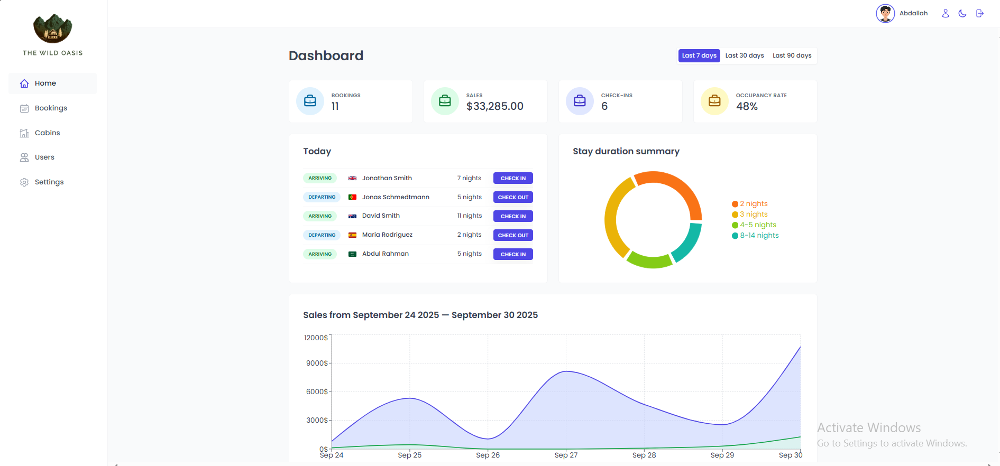
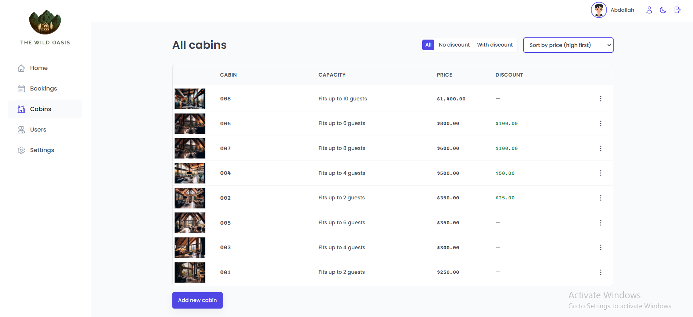
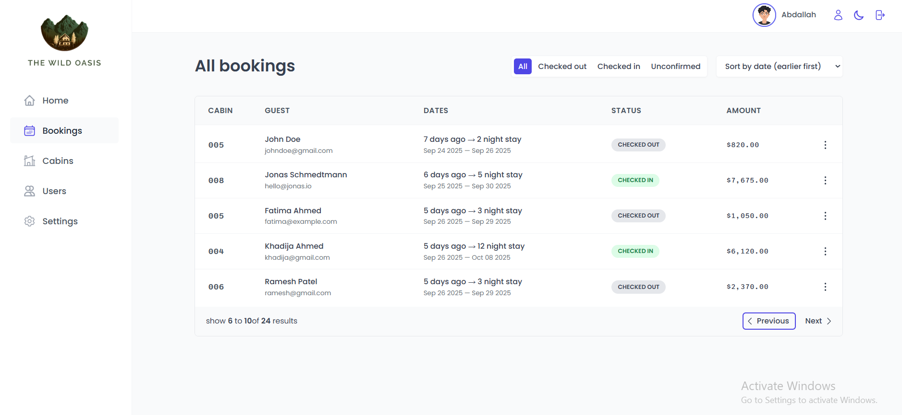
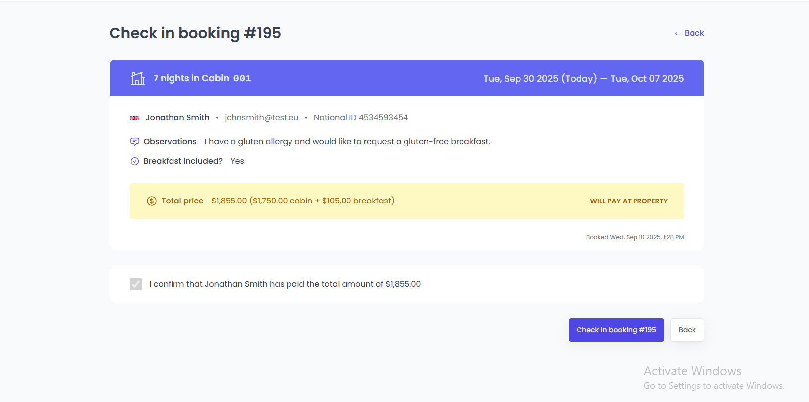

# 🏨 The Wild Hotel

A comprehensive hotel management system built with React and Supabase, designed for boutique hotels and luxury resorts to manage cabins, bookings, guests, and staff operations efficiently.

[](https://reactjs.org/)
[](https://vitejs.dev/)
[](https://supabase.com/)
[](https://styled-components.com/)

## 📋 Table of Contents

- [Features](#-features)
- [Demo & Screenshots](#-demo--screenshots)
- [Tech Stack](#-tech-stack)
- [Usage](#-usage)
- [Project Structure](#-project-structure)

## ✨ Features

### 🏠 **Cabin Management**

- View all hotel cabins with detailed information
- Add new cabins with photos and specifications
- Edit existing cabin details (capacity, pricing, discounts)
- Filter cabins by discount status (all, with discount, no discount)
- Sort cabins by name, capacity, or price
- Delete cabins with confirmation dialogs

### 📅 **Booking Management**

- Comprehensive booking overview with guest information
- Real-time booking status tracking (unconfirmed, checked-in, checked-out)
- Filter bookings by status and date range
- Sort bookings by date, amount, or guest name
- Detailed booking information with guest and cabin details
- Payment tracking and breakfast options

### 🔐 **Check-in/Check-out System**

- Streamlined check-in process with payment confirmation
- Quick check-out functionality
- Optional breakfast add-on during check-in
- Real-time status updates
- Guest information verification

### 👥 **User Authentication & Management**

- Secure user registration and login system
- Protected routes for authenticated users only
- User profile management
- Password update functionality
- Role-based access control

### 📊 **Dashboard & Analytics**

- Real-time statistics and KPIs
- Sales charts and revenue tracking
- Occupancy rates and booking trends
- Recent booking activity
- Duration charts for stay analysis
- Today's activity overview

### ⚙️ **Settings & Configuration**

- Hotel settings management
- Booking length constraints
- Guest capacity limits
- Breakfast pricing configuration
- System-wide preferences

## 🎯 Demo & Screenshots

### 📊 Dashboard



_Main dashboard with real-time statistics and analytics_

### 🏠 Cabin Management



_Cabin overview with filtering and sorting capabilities_

### 📅 Booking System



_Comprehensive booking management interface_

### 🔐 Check-in Process



_Streamlined guest check-in workflow_

#### Live Demo: https://the-wild-hotel-jet.vercel.app/

## 🛠 Tech Stack

### **Frontend**

- **React 18.2.0** - Modern React with Hooks
- **React Router 6.30.1** - Client-side routing
- **Styled Components 6.1.19** - CSS-in-JS styling
- **React Query 4.40.1** - Server state management
- **React Hook Form 7.62.0** - Form management
- **React Hot Toast 2.5.2** - Toast notifications
- **React Icons 5.5.0** - Icon library
- **Recharts 3.2.1** - Data visualization

### **Backend & Database**

- **Supabase** - Backend as a Service (BaaS)
- **PostgreSQL** - Relational database
- **Supabase Auth** - Authentication system
- **Supabase Storage** - File storage for cabin images

### **Development Tools**

- **Vite 4.4.5** - Fast build tool and dev server
- **ESLint** - Code linting and formatting
- **Date-fns 4.1.0** - Date manipulation utilities

## 📖 Usage

### For Hotel Staff:

1. **Login/Register**: Access the system with authenticated credentials
2. **Dashboard**: View real-time statistics and recent activities
3. **Manage Cabins**: Add, edit, or remove cabin listings
4. **Handle Bookings**: Process check-ins, check-outs, and booking modifications
5. **Guest Management**: View guest information and booking history
6. **Settings**: Configure hotel-specific settings and preferences

### Key Workflows:

- **New Booking Check-in**: Navigate to bookings → Select unconfirmed booking → Process check-in
- **Guest Check-out**: Find checked-in booking → Process check-out → Update payment status
- **Add New Cabin**: Go to cabins page → Add cabin → Upload photos → Set pricing
- **View Reports**: Dashboard provides comprehensive analytics and reporting

## 📁 Project Structure

```
the-wild-oasis/
├── public/                     # Static assets
│   ├── cabin-images/          # Cabin photos
│   └── logo-*.png            # Application logos
├── src/
│   ├── contexts/             # React contexts
│   ├── data/                 # Sample data and data uploader
│   ├── features/             # Feature-based components
│   │   ├── authentication/   # Login, signup, user management
│   │   ├── bookings/        # Booking management
│   │   ├── cabins/          # Cabin management
│   │   ├── check-in-out/    # Check-in/out processes
│   │   ├── dashboard/       # Dashboard and analytics
│   │   └── settings/        # Application settings
│   ├── hooks/               # Custom React hooks
│   ├── pages/               # Page components
│   ├── services/            # API services and Supabase client
│   ├── styles/              # Global styles
│   ├── ui/                  # Reusable UI components
│   └── utils/               # Utility functions
├── .env.example             # Environment variables template
├── package.json             # Dependencies and scripts
└── vite.config.js          # Vite configuration
```

## 🙏 Acknowledgments

- **Jonas Schmedtmann** - Original course instructor and project concept
- **Supabase Team** - For the excellent backend-as-a-service platform
- **React Community** - For the amazing ecosystem and tools

## 📞 Support

#### For support, email abdallahzeiada0@gmail.com or create an issue on GitHub.

---

⭐ **Star this repository if you find it helpful!**

#### Built with ❤️ by Abdallah Zeiada
